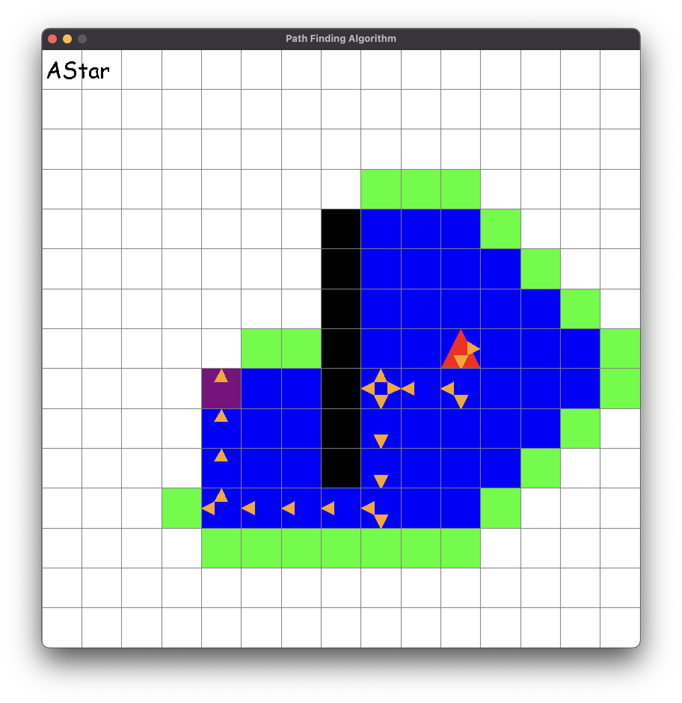

# visual_path_finding
A creative way of visually seeing how different Path-Finding algorithms work

## Pending optimizations
- _Don't add already closed nodes to the_ ```frontier``` _on node expansion_.
- _Check if the expanded node is the same as the ```target``` on node expansion_.

## How to use
- Left-click: 
    1. Player
    2. Target
    3. Walls
- Right-click:
    - Erase
- Keys:
    - ```R```: Rotate player
    - ```F```: Forward player
    - ```C```: Clear game
    - ```Space```: Compute plan
    - ```1```: Breadth-First-Search (BFS)
    - ```2```: Depth-First-Search (DFS)
    - ```3```: Dijkstra
    - ```4```: A-Start


## Color-coding
- Red: Player
- Purple: Target
- Black: Wall
- Blue: Closed nodes
- Green: Open nodes
- Orange: Plan steps

## Screenshot

